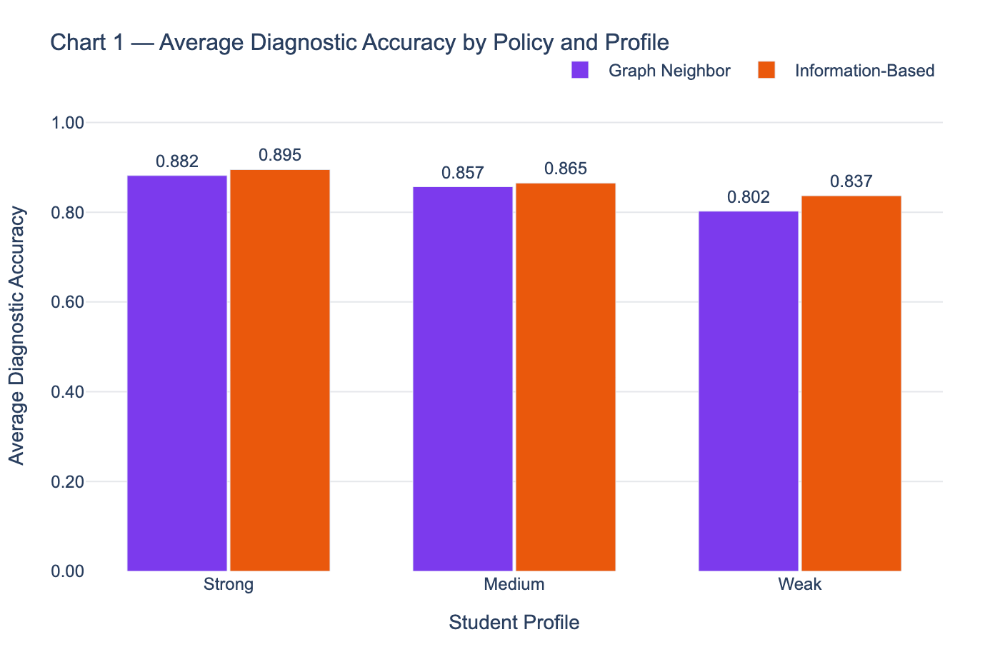
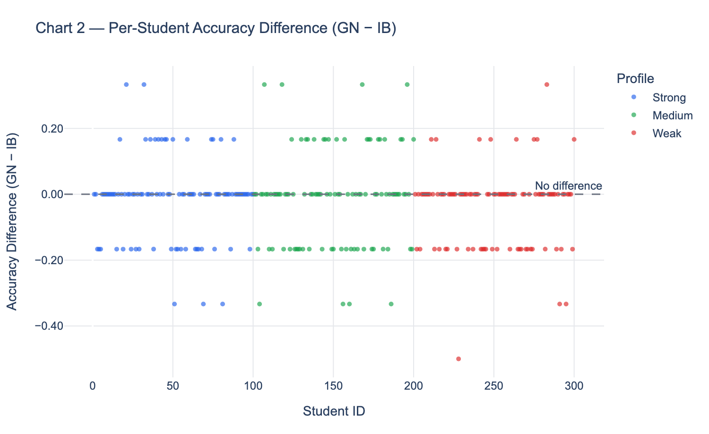
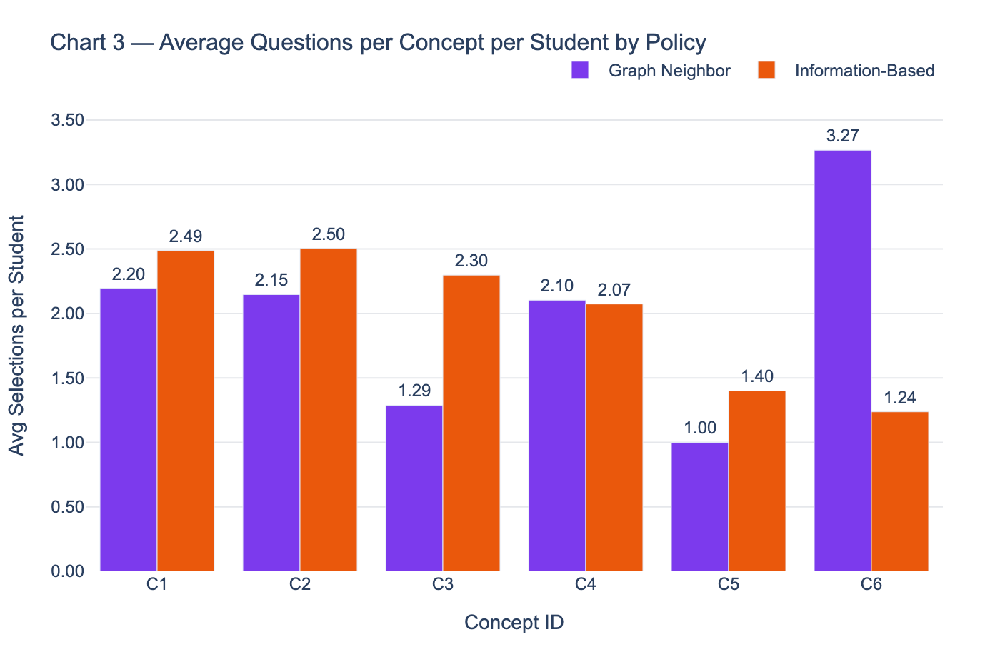
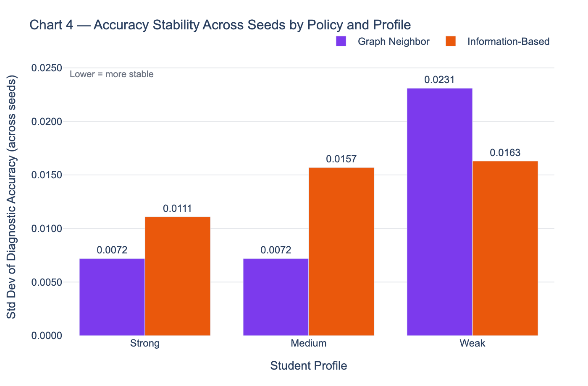

# AI-Driven Adaptive Testing in AILA: A Comparative Evaluation of Graph-Neighbor and Information-Based Question Selection Policies

**Author:** Ruhma Hashmi
**Course:** Independent Study
**Supervisor:** Dr. Yuan An
**Date:** June 2026

---

## 1. Introduction

Adaptive testing systems improve diagnostic efficiency by dynamically selecting questions
based on a learner's evolving performance, rather than administering a fixed sequence to
all students. AILA (An Intelligent Learning Assistant) provides an AI-driven learning
environment with an existing course knowledge graph and multiple-choice question bank,
creating a natural substrate for exploring concept-level adaptive diagnostic strategies.
Despite this infrastructure, the question of which selection policy best exploits the
knowledge graph structure for diagnostic purposes has not been empirically evaluated.

Question selection policy, which is the rule that determines which concept to probe next during
an adaptive session, is a fundamental design decision in any computerized adaptive
testing (CAT) system. Two broad classes of policy are relevant here: graph-constrained
policies, which restrict candidate questions to concepts neighboring the most recently
tested node in a knowledge graph, and information-based policies, which select globally
according to an uncertainty criterion without regard to graph structure. Whether the
additional constraint imposed by graph-based selection improves or degrades diagnostic
accuracy relative to unconstrained information-based selection is an open empirical
question in the context of concept-level mastery estimation.

This study addresses that question through a controlled simulation experiment. We
implement both policy types within a DINA-style probabilistic simulator operating over
a six-concept knowledge graph with four questions per concept. Three hundred simulated
students spanning three knowledge profiles — strong, medium, and weak — are evaluated
under each policy across three independent random seeds, yielding 900 student runs per
policy. Diagnostic accuracy, defined as the proportion of concepts correctly classified
at the end of each run, serves as the primary evaluation metric. Per-concept question
coverage and accuracy stability across seeds serve as secondary structural metrics.

This study asks: does question selection policy — graph-neighbor versus
information-based — produce a measurable difference in diagnostic accuracy in a
DINA-style adaptive simulator, and does any observed difference depend on student
knowledge level? The study is conducted entirely within a controlled simulation
environment; findings should be interpreted as characterizing policy behavior under
the specified model assumptions rather than as predictions of real classroom outcomes.

---

## 2. Related Work

### 2.1 Computerized Adaptive Testing and Item Response Theory

Computerized adaptive testing (CAT) improves the efficiency of educational assessment
by selecting items dynamically based on a continuously updated estimate of the
examinee's latent ability (Weiss, 1982; van der Linden & Glas, 2000). Rather than
administering a fixed item bank to all students, CAT systems apply a selection criterion
— most commonly maximum Fisher information or maximum likelihood estimation — to
identify the next item that is most informative given the current ability estimate.
This approach has been shown to reduce test length by 50% or more while maintaining
measurement precision comparable to full-length fixed-form tests (Wainer, 1990).

Standard CAT operates over a unidimensional ability scale and is not directly applicable
to settings where the diagnostic target is a multivariate mastery profile across discrete
concepts. The information-based selection policy implemented in this study is directly
inspired by CAT's uncertainty-reduction criterion, adapted to operate over a vector of
binary concept mastery estimates rather than a single continuous ability score.

### 2.2 Cognitive Diagnosis Models and the DINA Framework

Cognitive diagnosis models (CDMs) extend psychometric assessment from ability
estimation to the classification of fine-grained knowledge components (Rupp et al.,
2010). Unlike IRT, which estimates a single latent trait, CDMs model the joint mastery
state of multiple skills or concepts, producing a diagnostic profile that indicates which
competencies a student has and has not acquired. The Deterministic Input, Noisy AND-gate
model (DINA; Haertel, 1989; Junker & Sijtsma, 2001) is among the most widely studied
CDMs, representing each student as a binary mastery vector and modeling item responses
as a function of full mastery with stochastic slip and guess parameters.

The simulator in this study adopts DINA's binary mastery representation and
slip-guess response structure as a tractable ground-truth model against which diagnostic
accuracy can be measured exactly. This choice prioritizes experimental control — a known
true mastery state enables unambiguous accuracy measurement — over ecological validity,
a trade-off discussed further in the limitations section.

### 2.3 Knowledge Graphs in Adaptive Learning

Knowledge graphs encode prerequisite and associative relationships between learning
concepts, providing structural information that a purely item-level selection policy
does not exploit (Hsieh et al., 2019; Nakagawa et al., 2019). In knowledge-graph-based
adaptive learning systems, the graph constrains or guides item selection so that the
assessment path respects conceptual dependencies — for example, probing a prerequisite
concept before an advanced one, or clustering related concepts together within a
diagnostic session. AILA's course knowledge graph is a naturally available source of
this structural information.

The graph-neighbor selection policy evaluated in this study operationalizes this
principle directly: at each step, candidate questions are restricted to concepts that
are direct neighbors of the most recently tested concept in the knowledge graph. This
design tests whether graph-imposed locality produces a diagnostic benefit relative
to globally unconstrained information-based selection, which is the central empirical
question of this work.

---

## 3. Simulator Design

This section describes the components of the adaptive diagnostic simulator used in
this study. The simulator consists of five interdependent components: a knowledge
graph, a question bank, a student model, a mastery estimation module, and an adaptive
loop. All five components are shared identically across both experimental conditions.
The only element that varies between conditions is the question selection policy,
which is described in Section 4.

### 3.1 Knowledge Graph

The knowledge graph consists of six concept nodes with directed neighbor relationships
encoding associative proximity within the subject domain. Each concept node stores a
unique identifier and a list of direct neighbor concept IDs. The graph is not strictly
hierarchical — it includes cross-links between non-adjacent concepts — and is designed
to reflect a branching AILA-style topology rather than a simple linear sequence. The
neighbor relationships stored in the graph are the only structural information available
to the Graph Neighbor policy; the Information-Based policy does not access the graph
during selection.

### 3.2 Question Bank

The question bank contains 24 questions, four per concept. Each question is
parameterized by three values: a target concept ID, a slip parameter s = 0.10, and a
guess parameter g = 0.20. Slip and guess are held constant across all questions and
all students in this study. The question bank is fixed across all simulation runs;
no question is excluded or weighted differently between the two policy conditions.

### 3.3 Student Model

Each simulated student is characterized by a profile type and a true mastery vector.
The true mastery vector θ ∈ {0, 1}^6 encodes binary mastery status for each of the
six concepts, where θ_k = 1 indicates mastery of concept k and θ_k = 0 indicates
non-mastery. The true mastery vector is never directly observable by the adaptive
system — it is used only to simulate student responses and to evaluate diagnostic
accuracy at the end of each run.

Three student profile types are defined, differing in the probability that any given
concept is mastered at the time of student generation:

| Profile | Mastery probability per concept | Students per seed |
|---------|--------------------------------|-------------------|
| Strong  | p = 0.75                       | 100               |
| Medium  | p = 0.50                       | 100               |
| Weak    | p = 0.25                       | 100               |

Concept mastery values are sampled independently for each concept within each student.
A total of 300 students are generated per seed, giving 900 students per policy across
the three seeds used in this study.

### 3.4 Response Model

Student responses are generated using a DINA-style probabilistic response function.
Given a question targeting concept k, the probability of a correct response is:

P(correct | θ_k) = (1 - s) · θ_k + g · (1 - θ_k)

where s = 0.10 is the slip parameter and g = 0.20 is the guess parameter. This
formulation produces a correct response probability of 0.90 for mastered concepts
and 0.20 for non-mastered concepts, introducing realistic noise in both directions
without making the response model deterministic. Actual responses are sampled
as Bernoulli draws from this probability at runtime.

### 3.5 Mastery Estimation

The adaptive system maintains an estimated mastery vector m ∈ [0, 1]^6, initialized
at m_k = 0.5 for all k at the start of each student run. This initialization represents
maximum uncertainty and does not incorporate any prior knowledge of the student's
history. After each question-response step, the estimate for the tested concept is
updated according to a fixed-step rule:

m_k ← m_k + α     if the response is correct
m_k ← m_k - α     if the response is incorrect

where α = 0.1 is the update step size, held constant across all runs. The estimate
is clipped to [0, 1] after each update. Estimates for all other concepts remain
unchanged. The update rule is identical under both policy conditions.

A concept is classified as mastered in the final diagnosis if m_k ≥ 0.5 at the end
of the run, and as non-mastered otherwise. Diagnostic accuracy is then computed as
the proportion of the six concepts for which this classification matches the student's
true mastery state θ_k.

### 3.6 Stopping Rule

Each student run terminates when one of two conditions is met: the maximum question
limit of 12 is reached, or all concept estimates have remained stable — defined as
|Δm_k| < ε across consecutive steps for all k — for a specified number of consecutive
steps. In the current evaluation, the 12-question hard limit is the binding constraint
for all student runs; no student converges early under either policy. This means the
two policies are compared under exactly equal question budgets, and any accuracy
difference reflects selection quality rather than question count.

---

## 4. Algorithms

This section formally describes the adaptive loop and the two question selection
policies evaluated in this study. The adaptive loop structure and all components
outside the selection step are identical across both policy conditions.

### 4.1 Adaptive Loop

The adaptive loop iterates over question-response cycles until the stopping criterion
is met. At each step, a question is selected by the active policy, the student's
response is simulated, the mastery estimate is updated, and the step is logged.
The loop is formalized as follows:

ADAPTIVE_LOOP(student, policy, graph, question_bank, config):

Initialize m_k = 0.5 for all k ∈ {1, ..., 6}
Initialize step_count = 0
Initialize log = []

WHILE step_count < MAX_QUESTIONS:
q ← SELECT_QUESTION(policy, graph, question_bank, m, last_concept)
r ← SIMULATE_RESPONSE(student.true_mastery, q)
m ← UPDATE_ESTIMATE(m, q.concept_id, r, α)
log.APPEND(step, q, r, m_before, m_after)
step_count ← step_count + 1

IF CONVERGED(m, threshold, consecutive_steps):
BREAK

RETURN log, m, step_count, stop_reason

The SELECT_QUESTION call is the only step that differs between the two policy
conditions. All other operations — response simulation, mastery update, logging,
and convergence checking — are executed identically regardless of which policy
is active.

### 4.2 Graph Neighbor Policy

The Graph Neighbor policy restricts candidate question selection to concepts that
are direct neighbors of the most recently tested concept in the knowledge graph.
Among those neighbors, the concept with the highest uncertainty score is selected,
and a question targeting that concept is drawn from the question bank.

SELECT_QUESTION_GN(graph, question_bank, m, last_concept):

neighbors ← graph.GET_NEIGHBORS(last_concept)
candidates ← questions in question_bank WHERE concept_id IN neighbors
AND question not yet asked

IF candidates is empty:
candidates ← ALL remaining unasked questions // global fallback

FOR each candidate q in candidates:
score(q) ← m[q.concept_id] × (1 - m[q.concept_id])

RETURN candidate q* with highest score(q*)

The uncertainty score m_k(1 - m_k) is maximized at m_k = 0.5 and approaches
zero as the estimate converges toward 0 or 1. The global fallback activates when
all neighbor-concept questions have been exhausted, preventing the policy from
stalling. The fallback reverts to global information-based selection for the
remainder of that student's run.

### 4.3 Information-Based Policy

The Information-Based policy selects globally from all remaining unasked questions,
without regard to graph structure. At each step it identifies the concept with the
highest uncertainty across the entire question bank and selects a question targeting
that concept.

SELECT_QUESTION_IB(question_bank, m):

candidates ← ALL remaining unasked questions

FOR each candidate q in candidates:
score(q) ← m[q.concept_id] × (1 - m[q.concept_id])

RETURN candidate q* with highest score(q*)

The Information-Based policy is equivalent to maximum-entropy item selection in
standard CAT, adapted to operate over concept-level mastery estimates rather than
a unidimensional ability parameter. It does not use the knowledge graph at any
point during selection.

### 4.4 Comparability of the Two Policies

The two policies share the same uncertainty scoring function, the same question
bank, and the same mastery estimation procedure. The sole structural difference is
that Graph Neighbor constrains the candidate pool to graph neighbors before scoring,
while Information-Based scores the full candidate pool without constraint. This
design ensures that any observed difference in diagnostic accuracy between the two
conditions is attributable to the selection constraint rather than to differences
in scoring, estimation, or stopping behavior.

---

## 5. Experiments

### 5.1 Simulation Setup

Both policies were evaluated within the same simulator, with a fixed knowledge graph
of six concepts, a question bank of 24 questions (four per concept), and a 12-question
hard limit per student run. Configuration parameters were held constant across all
conditions: slip s = 0.10, guess g = 0.20, mastery update step α = 0.1, and initial
mastery estimates m_k = 0.5 for all concepts. The stopping criterion was the 12-question
hard limit; no student reached early convergence under either policy in this evaluation.

### 5.2 Student Population

Three hundred students were generated per experimental run, split equally across three
profile types: 100 strong (mastery probability p = 0.75 per concept), 100 medium
(p = 0.50), and 100 weak (p = 0.25). Concept mastery values were sampled independently
for each concept within each student using a fixed random seed. Both policies were run
on identical student populations — the same 300 students, generated from the same seed,
were used for both Graph Neighbor and Information-Based runs within each batch. This
ensures that any observed accuracy difference reflects policy behavior rather than
differences in the student population.

### 5.3 Multi-Seed Evaluation

To assess the stability of results across different student populations, the full
experimental batch was repeated across three independent random seeds: 42, 99, and 7.
Each seed produces a distinct population of 300 students; both policies are run on
the same student population within each seed. This yields 900 student runs per policy
in total. Evaluation metrics are computed as per-seed averages first — mean accuracy
across 300 students within each seed — and then averaged across the three seeds. This
two-stage averaging ensures each seed contributes equally to the final reported metrics
regardless of any minor variation in student count.

### 5.4 Evaluation Metrics

The primary evaluation metric is diagnostic accuracy, defined as the proportion of
the six concepts correctly classified at the end of each student run — that is, the
proportion for which the final binary classification of the estimated mastery vector
matches the student's true mastery vector. The secondary metrics are per-concept
question coverage, computed as the average number of times each concept was selected
per student across all seeds, and accuracy stability, measured as the standard deviation
of per-seed mean accuracy across the three seeds. Per-student accuracy differences
between the two policies are also examined to assess whether one policy dominates
uniformly or only on average.

---

## 6. Results

### 6.1 Diagnostic Accuracy by Policy and Profile

Information-Based selection produced higher average diagnostic accuracy than Graph
Neighbor across all three student profiles, with the performance gap widening as
student knowledge level decreased. For strong students, the margin was modest —
Information-Based achieved a mean accuracy of 0.895 compared to Graph Neighbor's 0.8817, a difference of 0.0133. For medium students, the gap was 0.0083 (IB: 0.865, GN: 0.8567). For weak students, the advantage widened to 0.0345 (IB: 0.8367, GN: 0.8022), representing the largest policy-induced accuracy difference observed in this study. The widening gap for weaker students suggests that the consequences of suboptimal question selection are more severe when mastery is low — a student with limited knowledge has fewer mastered concepts to anchor the session, making
the policy's ability to identify and probe uncertain concepts globally more
consequential than its ability to follow local graph structure (Figure 1).

### 6.2 Per-Student Accuracy Differences

Examining accuracy differences at the individual student level reveals that neither
policy dominates absolutely — both policies produce higher accuracy than the other
for a meaningful subset of students. The per-student accuracy difference (Graph Neighbor minus Information-Based) is plotted against student ID, coloured by profile type, in Figure 2.

Points above the zero line represent students for whom Graph Neighbor produced higher
accuracy; points below represent students for whom Information-Based was superior.
The distribution is mixed across all three profiles, confirming that the average
advantage of Information-Based does not reflect uniform dominance. Among strong
students, IB outperformed GN for 24 students while GN outperformed IB for 16,
with 60 students showing no difference. The imbalance grew for medium students
(IB better for 30, GN better for 23, equal for 47) and was most pronounced for
weak students, where IB outperformed GN for 30 students while GN outperformed IB
for only 9 — a 3.3:1 ratio that is directly consistent with the group-level
accuracy gap reported in Section 6.1. The spread of the distribution also suggests that the policy
effect is not constant: some students benefit substantially from one policy while
others show no meaningful difference, pointing toward student-level variation in
how effectively each policy exploits the local graph structure versus global
uncertainty.

### 6.3 Per-Concept Question Coverage

Information-Based distributed questions relatively evenly across the six concepts,
with per-concept averages ranging from 1.24 to 2.50 questions per student across
all profiles. Graph Neighbor concentrated coverage unevenly, assigning an average
of 3.27 questions per student to concept C6 while allocating only 1.00 to C5
and 1.29 to C3.

The mechanism is direct: a concept that receives fewer questions under a given policy
will have a less updated mastery estimate at the end of the run, increasing the
probability of misclassification. Under Graph Neighbor, concepts C3 and C5 received
systematically fewer questions across all three seeds and all three profile types,
meaning their mastery status was less reliably determined. Under Information-Based,
the global uncertainty criterion ensured that no concept accumulated a large question
deficit — when any concept's estimate remained near 0.5, it was eligible for selection
regardless of its position in the graph. The coverage pattern is therefore not a
secondary structural observation — it is the mechanistic explanation for why
Information-Based achieved higher accuracy across all conditions.

### 6.4 Accuracy Stability Across Seeds

For strong students, Graph Neighbor was more stable — a standard deviation of 0.0072
compared to Information-Based's 0.0111. For medium students, the pattern held — GN
again at 0.0072 versus IB at 0.0157. For weak students, the relationship reversed:
Graph Neighbor's standard deviation rose to 0.0231, substantially exceeding
Information-Based's 0.0163, making GN the less consistent policy for the student
group where accurate diagnosis matters most.

The instability of Graph Neighbor for weak students is consistent with its coverage
behavior. Weak students have mastered fewer concepts, meaning the graph's local
traversal is more likely to navigate toward or away from the specific concepts a
given student has or has not mastered — an outcome that depends heavily on which
concept happens to anchor the session. When the graph traversal aligns well with
the student's mastery gaps, Graph Neighbor performs adequately; when it does not,
accuracy suffers. This alignment is seed-dependent, producing the higher
cross-seed variance observed for weak students. Information-Based, by probing
globally, is less sensitive to the starting concept and therefore more consistent
across seeds.

---

## 7. Limitations

The evaluation presented in this report was conducted within a controlled simulation
environment designed to enable clean comparison between the two policies. Several
design decisions simplify the evaluation setting relative to real adaptive tutoring
deployments. Each is acknowledged here with its consequence for interpreting the
findings.

### 7.1 Binary Mastery Representation

Student mastery is represented as a binary value per concept — a student either has
or has not mastered a given concept. This representation enables a precise definition
of diagnostic accuracy: the fraction of concepts whose final estimated mastery
matches the true binary label. In practice, student knowledge exists on a continuum;
a student may have partial mastery of a concept, demonstrating it under some question
types but not others. The binary representation used here means the evaluation
measures classification accuracy over a simplified ground truth. The finding that
Information-Based outperforms Graph Neighbor in binary classification accuracy holds under this representation; whether the same advantage persists when mastery is continuous and the evaluation criterion is mean squared error rather than classification accuracy is an open question this study does not address.

### 7.2 Independent Concept Mastery Generation

Each student's mastery of the six concepts is sampled independently — a student's
mastery of concept C3 is generated without conditioning on their mastery of C1, even
if the knowledge graph encodes C1 as a prerequisite of C3. This simplifies student
generation and ensures that the three profile types produce students who differ
systematically in their overall mastery levels. However, it means the student
population does not reflect the prerequisite structure that the Graph Neighbor policy
is designed to exploit. A student who has mastered C1 is no more likely to have
mastered C3 than one who has not, even when C1 → C3 in the graph. This may
systematically understate Graph Neighbor's advantage in a real student population,
where prerequisite structure is real — knowing C1 genuinely makes C3 more likely,
which would make local graph traversal a more informative strategy. The findings
should therefore be interpreted as reflecting performance on a population where the
graph structure is less predictive of mastery co-occurrence than it would be in
a real classroom.

### 7.3 Fixed Slip and Guess Parameters

The DINA-style response model uses fixed slip (s = 0.10) and guess (g = 0.20) parameters
across all concepts and all students. These values are plausible for a low-noise
setting but were not validated against real response data. The relative accuracy
advantage of Information-Based over Graph Neighbor depends on how noisily student
responses reflect true mastery — with higher slip and guess values, mastery estimates
update more slowly and the information value of individual questions changes. The
direction of the IB advantage is expected to be robust, since coverage unevenness
under Graph Neighbor would remain a limitation regardless of noise level. However,
the magnitude of the advantage — 0.0133 for strong students, 0.0345 for weak
students — may be sensitive to slip and guess values and should not be treated as
precise effect sizes without further sensitivity analysis.

### 7.4 Cold-Start Mastery Initialization

All concept mastery estimates are initialized at 0.5 — the point of maximum
uncertainty — for every student at the start of every session. This
initialization is standard in cold-start scenarios but may favour
Information-Based selection. Since IB selects the concept with maximum expected
information, and all concepts begin at equal uncertainty, IB's early selections
are effectively arbitrary — it has no prior to exploit. This means the observed IB advantage may be partially an artifact of the cold-start setting: both policies begin with identical uncertainty, which removes any advantage the graph could offer in early concept prioritization. As the session progresses and estimates diverge, IB's advantage becomes meaningful. Warm-start scenarios, in
which prior session data is available to initialize estimates at values other than
0.5, would change the early-session selection behavior of both policies and may
alter the relative accuracy gap. The findings reported here apply specifically to
cold-start evaluation; warm-start performance is an open question.

### 7.5 Simulation versus Language-Based Question Selection

The question selection criterion used in this evaluation is information-theoretic:
both policies select questions by reasoning over mastery estimates and graph
structure. AILA's actual question selection uses natural language processing to
match student queries to question bank items based on embedding similarity or
keyword overlap. This is a different selection mechanism. The information-based
policy evaluated here is an idealized version of what a probabilistic adaptive
layer would do if layered on top of AILA's existing NLP matching — it does not
replace NLP matching and cannot be dropped directly into AILA without an
integration layer that bridges the two mechanisms. Section 9 addresses this
integration question directly.

---

## 8. Future Work

### 8.1 Continuous Mastery and Extended Mastery Models

The binary mastery representation used in this evaluation is the most tractable
formulation of the mastery estimator but not the most realistic. A direct extension would replace
each concept's binary true mastery label with a continuous mastery probability,
sampled from a Beta distribution with parameters tuned to each profile type. Mastery
update rules would remain the same, but the evaluation metric would shift from
classification accuracy to root mean squared error between the final posterior mean
and the true mastery probability. This extension would test whether the coverage
advantage of Information-Based translates into lower estimation error under
continuous mastery — a stronger claim than classification accuracy.

A further extension within this direction is to implement the Deep Knowledge Tracing
(DKT) formulation, in which mastery is estimated by an LSTM rather than the fixed-step
update rule. DKT has been shown to outperform BKT on real student response
datasets; comparing IB and GN policies on top of a DKT mastery model would
test whether the policy advantage is model-dependent or robust across mastery
representations.

### 8.2 Correlated Concept Generation with Prerequisite Structure

The most significant gap between this simulation and a real student population is
the absence of prerequisite-correlated mastery generation. A concrete extension
would generate student mastery vectors by propagating mastery probabilities through
the knowledge graph: if C1 is a prerequisite of C3, the probability of mastering
C3 is conditioned on mastery of C1. This could be implemented as a topological
ordering of the graph nodes, with each node's mastery probability computed as a
weighted function of its parents' mastery values plus a student-specific noise term.

Under correlated generation, Graph Neighbor's local traversal strategy would have
genuine signal to exploit — a student who has mastered C1 and C2 is likely to have
mastered C3, making the graph-following strategy more informative. Re-running the
evaluation under correlated generation would determine whether GN's accuracy
disadvantage is an artifact of the independent generation assumption or whether
it persists even when the graph reflects real structure.

### 8.3 Sensitivity Analysis over Slip and Guess Parameters

The fixed slip (s = 0.10) and guess (g = 0.20) parameters used in this evaluation
represent one point in a two-dimensional parameter space. A systematic sensitivity
analysis would vary both parameters independently across a grid — for example, slip
in {0.05, 0.10, 0.20, 0.30} and guess in {0.10, 0.20, 0.30} — and re-run the full
evaluation for each combination, reporting the IB–GN accuracy gap as a function of
slip and guess. This analysis would quantify how robust the IB advantage is to
noise level and would identify the parameter regime, if any, under which GN performs
comparably or better. The stability findings (Section 6.4) would also be worth
re-examining under higher noise, since instability under GN for weak students may
be amplified or attenuated by response noise level.

---

## 9. AILA Extension

### 9.1 Replacing Simulated Students with Real Users

The simulation in this report generates students by sampling binary mastery vectors
from a probability distribution. Real AILA users are not generated — they arrive
with prior interaction histories, partially formed knowledge states, and response
patterns that do not fit neatly into any parameterized profile type. Replacing
simulated students with real users requires three changes to the evaluation
infrastructure.

First, the mastery state must be initialized from prior session data rather
than set to 0.5 across all concepts. AILA logs user interactions; a warm-start
initializer would read the most recent session's final mastery estimates and use
them as the starting state for the next session. Second, the concept set must
expand from six abstract nodes to the full set of concepts represented in AILA's
knowledge graph, which includes topic-level and subtopic-level nodes with
heterogeneous connectivity. Third, true mastery labels — needed to compute
diagnostic accuracy — are not available for real users. Evaluation would shift
from accuracy to proxy metrics such as question response correctness rate or
post-session assessment score, requiring a separate ground-truth collection
mechanism such as a brief end-of-session quiz.

### 9.2 Integrating with AILA's Question Bank and Knowledge Graph

AILA's question bank is organized differently from the 24-question bank used in
this simulation. Questions are matched to concepts through NLP-based tagging —
each question is associated with one or more concept nodes based on keyword and
embedding similarity between the question text and the concept label. Integrating
the adaptive selection policies requires a concept-to-question index: a mapping
from each concept node to the set of questions tagged to that concept, used to
retrieve candidate questions once the policy selects a target concept.

The knowledge graph integration is more direct. AILA already maintains a graph
of concept dependencies; the Graph Neighbor policy can read its adjacency list
directly to determine neighbor concepts for selection. The Information-Based policy
does not use the graph and requires only the mastery estimate vector, making it
easier to integrate but less tied to AILA's existing graph infrastructure. A
practical deployment would run both policies in parallel — IB for new users in
cold-start sessions, GN for returning users with established mastery estimates —
and use per-user accuracy metrics collected over time to evaluate which policy
produces better diagnostic outcomes in the real classroom setting.

### 9.3 Ethical Considerations of Adaptive Testing

Deploying adaptive diagnostic testing in a real classroom introduces ethical
considerations that are absent from a simulation study. Three are worth naming
explicitly.

The first is transparency. Students should know that the questions they receive
are selected by an algorithm based on their estimated mastery state, not randomly
or uniformly. Opaque adaptive systems risk undermining student trust if the
selection rationale is not explainable.

The second is mastery labelling error. Mastery estimates under the fixed-step update rule are noisy. A student
who performs poorly on a few questions in one session may be labelled as
non-master of a concept and subsequently receive remedial questions in future
sessions, even if the low performance was due to a bad day or misread question
rather than genuine lack of mastery. Persistent mislabelling creates a feedback
loop: the system continues probing a concept the student has actually mastered,
reducing the diversity of questions they receive. Error-correction mechanisms —
such as a mastery confidence threshold below which the system refrains from hard
classification — would mitigate this risk.

The third is equity. If different student profiles systematically receive different
question sequences, and if question diversity affects learning outcomes as well as
diagnostic accuracy, then the adaptive policy is not merely measuring knowledge
differences — it is potentially widening them. An audit of question diversity by
demographic group, if AILA collects such data, would be a minimum prerequisite
before deploying adaptive selection at scale.

---

## 10. References

Haertel, E. H. (1989). Using restricted latent class models to map the skill structure
of achievement items. *Journal of Educational Measurement*, 26(4), 301–321.

Junker, B. W., & Sijtsma, K. (2001). Cognitive assessment models with few assumptions,
and connections with nonparametric item response theory.
*Applied Psychological Measurement*, 25(3), 258–272.

Rupp, A. A., Templin, J., & Henson, R. A. (2010). *Diagnostic Measurement:
Theory, Methods, and Applications*. Guilford Press.

van der Linden, W. J., & Glas, C. A. W. (Eds.). (2000).
*Computerized Adaptive Testing: Theory and Practice*. Kluwer Academic Publishers.

Wainer, H. (Ed.). (1990). *Computerized Adaptive Testing: A Primer*.
Lawrence Erlbaum Associates.

Weiss, D. J. (1982). Improving measurement quality and efficiency with adaptive
testing. *Applied Psychological Measurement*, 6(4), 473–492.
